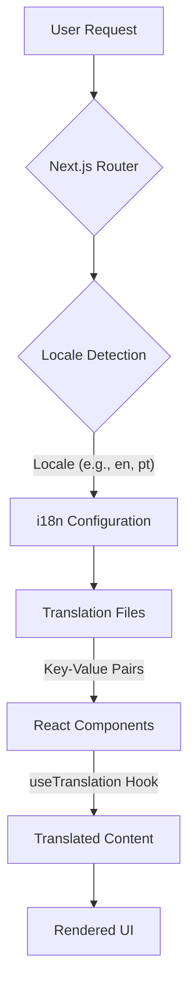

# Internationalization Plan: Portuguese to English Translation

## 1. Analysis of Existing Project for i18n Setup

Based on the file structure and `package.json`, there is no existing internationalization (i18n) framework or established pattern in place. The project is a Next.js application, which provides built-in i18n capabilities.

## 2. Proposed Strategy for Translation

The proposed strategy is to leverage Next.js's built-in i18n routing and integrate `react-i18next` for managing translations within React components. This combination offers a robust and widely adopted solution for internationalization in Next.js applications.

### Architecture Diagram



**Explanation:**

*   **User Request:** The user accesses the application.
*   **Next.js Router:** Handles routing based on locale (e.g., `/en/dashboard`, `/pt/dashboard`).
*   **Locale Detection:** Next.js automatically detects the preferred locale from the browser or URL.
*   **i18n Configuration:** `next.config.mjs` will be configured to support multiple locales (Portuguese `pt` and English `en`) and define the default locale.
*   **Translation Files:** JSON files (e.g., `public/locales/pt/common.json`, `public/locales/en/common.json`) will store key-value pairs for translated strings.
*   **React Components:** Components will use the `useTranslation` hook from `react-i18next` to access translated strings based on the active locale.
*   **Translated Content:** The appropriate translated string is retrieved.
*   **Rendered UI:** The application renders the UI with the translated content.

## 3. Outline Steps for Content Extraction and Translation

1.  **Identify User-Facing Strings:**
    *   Manually review all `.tsx` and `.ts` files within the `src/app` and `src/components` directories.
    *   Look for hardcoded Portuguese strings in JSX, component props, and any other user-visible text.
    *   Pay close attention to:
        *   Page titles and headings
        *   Button labels and link text
        *   Form labels and placeholder text
        *   Error messages and success notifications
        *   Any static content displayed to the user.

2.  **Extract Strings into Translation Files:**
    *   Create a `public/locales` directory.
    *   Inside `public/locales`, create subdirectories for each language: `pt` and `en`.
    *   Within each language directory, create translation files (e.g., `common.json`, `dashboard.json`, `auth.json`) to categorize strings logically.
    *   For each identified Portuguese string, create a unique key and add it to the `pt/common.json` (or other relevant) file.
    *   Example:
        ```json
        // public/locales/pt/common.json
        {
          "welcome_message": "Bem-vindo ao nosso aplicativo!"
        }
        ```

3.  **Translate Strings to English:**
    *   For each key in the Portuguese translation files, provide the corresponding English translation in the `en/common.json` (or other relevant) file.
    *   Example:
        ```json
        // public/locales/en/common.json
        {
          "welcome_message": "Welcome to our application!"
        }
        ```

4.  **Replace Hardcoded Strings with Translation Keys:**
    *   In the React components, replace the hardcoded Portuguese strings with the `t()` function from `react-i18next`, using the defined translation keys.
    *   Example:
        ```typescript
        // Before
        // <h1>Bem-vindo ao nosso aplicativo!</h1>

        // After
        import { useTranslation } from 'react-i18next';
        // ...
        const { t } = useTranslation();
        // ...
        // <h1>{t('welcome_message')}</h1>
        ```

## 4. Detailed Todo List for Implementation Phase

This detailed todo list will guide the implementation in Code mode.

### Setup i18n Framework

*   [ ] Install `react-i18next` and `i18next` dependencies.
*   [ ] Configure `next.config.mjs` for i18n routing (locales: `pt`, `en`; defaultLocale: `pt`).
*   [ ] Create `i18n.js` configuration file in the root of the project to initialize `i18next` and load translation files.
*   [ ] Wrap the `_app.js` (or `layout.tsx` in App Router) with `I18nextProvider` to make translations available throughout the application.

### Content Extraction and Translation

*   [ ] Create `public/locales/pt` and `public/locales/en` directories.
*   [ ] Create initial translation files (e.g., `common.json`) in both `pt` and `en` directories.
*   [ ] Systematically go through `src/app` and `src/components` directories to identify all user-facing Portuguese strings.
*   [ ] Extract identified Portuguese strings into `public/locales/pt/*.json` files, assigning unique keys.
*   [ ] Provide English translations for all extracted keys in `public/locales/en/*.json` files.
*   [ ] Replace hardcoded Portuguese strings in components with `t('translation_key')` using the `useTranslation` hook.

### Testing and Verification

*   [ ] Implement a language switcher component (e.g., a dropdown or buttons) to allow users to change the locale.
*   [ ] Test the application thoroughly in both Portuguese and English locales to ensure all content is correctly translated.
*   [ ] Verify that dynamic content (if any) is also handled correctly by the i18n setup.

## 5. Plan Approval

Please review this plan and let me know if you are pleased with it or if you would like to make any changes. Once approved, I will switch to Code mode to begin the implementation.